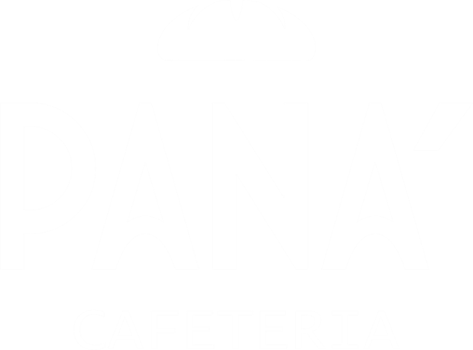

# El Café Con La Pan-dilla - Panadería/Cafetería

 <!-- Añade una imagen banner si dispones de ella -->

## Descripción del Proyecto

Página web completa para una panadería/cafetería con catálogo de productos, sistema de usuarios y carrito de compras. Desarrollada con tecnologías web estándar y PHP para el backend.

## Características Principales

✅ Catálogo de productos organizado por categorías (cafés, panes, postres)  
✅ Sistema de registro y autenticación de usuarios seguro  
✅ Carrito de compras con persistencia en localStorage  
✅ Diseño responsive y adaptable a móviles  
✅ Tema claro/oscuro con preferencia guardada  
✅ Música ambiental opcional  
✅ Protección básica contra inyección SQL  

## Tecnologías Utilizadas

- **Frontend**: HTML5, CSS3, JavaScript (ES6)
- **Backend**: PHP 7.0+
- **Base de Datos**: MySQL
- **Servidor**: Apache (XAMPP)
- **Control de Versiones**: Git/GitHub

## Requisitos del Sistema

- Servidor XAMPP/WAMPP (Apache + MySQL)
- PHP 7.0 o superior
- MySQL (puerto 3306 por defecto)
- Navegador web moderno (Chrome, Firefox, Edge)

## Instalación

### 1. Configuración del Entorno

1. Instalar [XAMPP](https://www.apachefriends.org/es/index.html)
2. Iniciar los servicios Apache y MySQL desde el panel de control

### 2. Configuración de la Base de Datos

```bash
# Acceder a MySQL (usando XAMPP)
mysql -u root -p

# Crear la base de datos
CREATE DATABASE panaderia;

# Crear tabla de usuarios
USE panaderia;

CREATE TABLE usuarios (
    id INT AUTO_INCREMENT PRIMARY KEY,
    nombre VARCHAR(50) NOT NULL,
    apellido VARCHAR(50) NOT NULL,
    usuario VARCHAR(50) NOT NULL UNIQUE,
    correo VARCHAR(100) NOT NULL UNIQUE,
    contrasena VARCHAR(255) NOT NULL,
    fecha_reg VARCHAR(20) NOT NULL
);
```

### 3. Configuración del Proyecto

1. Clonar el repositorio en la carpeta `htdocs` de XAMPP:
```bash
git clone https://github.com/tu-usuario/el-cafe-con-la-pan-dilla.git
```

2. Configurar la conexión a la base de datos editando `php/conexion_be.php`:
```php
$conexion = mysqli_connect("localhost", "root", "tu_contraseña", "panaderia", 3306);
```

### 4. Iniciar la Aplicación

1. Iniciar Apache y MySQL desde el panel de control de XAMPP
2. Acceder a la aplicación desde:
```
http://localhost/el-cafe-con-la-pan-dilla
```

## Estructura del Proyecto

```
.
├── css/                  # Estilos CSS
├── img/                  # Imágenes del sitio
│   ├── café/             # Imágenes de cafés
│   ├── panes/            # Imágenes de panes
│   ├── postre/           # Imágenes de postres
│   └── tortas/           # Imágenes de tortas
├── js/                   # Scripts JavaScript
├── musica/               # Archivos de música
├── php/                  # Backend PHP
├── index.php             # Página principal
├── catalogo.php          # Catálogo de productos
├── nosotros.php          # Información de la empresa
├── registrar.php         # Registro/Login
├── bienvenida.php        # Dashboard de usuario
└── carrito.php           # Carrito de compras
```

## Uso

1. **Página Principal**: Muestra un carrusel con productos destacados
2. **Catálogo**: Explorar productos por categorías
3. **Registro/Login**: Crear cuenta o iniciar sesión
4. **Carrito**: Añadir productos y gestionar pedidos
5. **Modo Oscuro**: Alternar en el menú superior

## Contribución

Las contribuciones son bienvenidas. Sigue estos pasos:

1. Haz un fork del proyecto
2. Crea una rama para tu feature (`git checkout -b feature/AmazingFeature`)
3. Haz commit de tus cambios (`git commit -m 'Add some AmazingFeature'`)
4. Haz push a la rama (`git push origin feature/AmazingFeature`)
5. Abre un Pull Request

## Licencia

Distribuido bajo la licencia MIT. Consulta `LICENSE` para más información.

## Contacto

Roger Garcia - tuemail@example.com

Enlace del Proyecto: [https://github.com/tu-usuario/el-cafe-con-la-pan-dilla](https://github.com/tu-usuario/el-cafe-con-la-pan-dilla)
